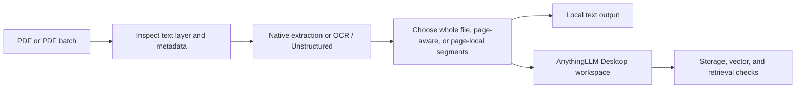

# AnythingLLM PDF Parser and Embedder Assistant

This Windows-local assistant turns one PDF, a selected set of PDFs, or a PDF
folder into inspectable text records for AnythingLLM Desktop. It can also stop
after local preparation, which is useful when you want to review the text or
upload it manually.

AnythingLLM can ingest PDFs directly. This project takes a different route
when page-aware retrieval matters: it prepares controllable text records with
source-page provenance before submitting them through AnythingLLM Desktop's
managed workspace path. That makes the application's claim modest and
testable: a page-aware record is only called ready after the expected
current-run record identities and their vector evidence have been confirmed.

The local web application runs on `http://127.0.0.1:7860`. PDF extraction,
OCR decisions, segmentation, local artifacts, and the app's own reports stay
on the machine. In upload mode, AnythingLLM Desktop then uses the embedding
provider configured inside Desktop. A local provider and a cloud provider have
very different privacy and retention policies; review the provider you chose
before using sensitive text.

The assistant supports native-text PDFs, selective or full Tesseract OCR, and
Unstructured-assisted extraction for difficult layouts. It examines PDF
metadata and document structure, can include or exclude front/back matter,
and keeps the generated output available for review. Preparation is often
quick; total upload time is commonly dominated by AnythingLLM Desktop's queue
and the configured embedding provider.

> **AI-assisted disclosure:** this project was completely vibe-coded through
> iterative AI-assisted development. Treat it as beta software: review the
> generated outputs and test it with your own AnythingLLM configuration before
> using it for consequential work.

> **Use at your own risk.** This software is provided under the MIT License,
> without warranty of any kind. It is not affiliated with, endorsed by, or
> supported by Mintplex Labs or AnythingLLM.


## Example Screenshots


**No more this:**


## Why use it?

- Prepare a whole PDF, one record per page, page-preserving records, smaller
  page-local passages, or explicit consecutive page groups.
- Select one PDF, several PDFs, or recursively scan a folder and choose the
  PDFs from that folder that belong in a batch.
- Keep extraction/OCR local and choose whether to create local files only or
  submit prepared records to an existing or newly created AnythingLLM
  workspace.
- Retain inspectable output, source metadata, page ranges, progress evidence,
  and a run report instead of treating one accepted HTTP request as success.
- Reuse a current selection to adjust settings without reopening the file
  picker. This starts a fresh setup pass; it never silently resumes an old run.
- Use light, dark, or Windows-following appearance settings and launch the
  application from Windows desktop shortcuts after installation.
- Optionally use the Desktop refresh bridge when a validated installation of
  that bridge is appropriate for the local AnythingLLM version.

AnythingLLM supports multiple document types, including PDFs. This assistant
intentionally prepares text records because controlling the text record and its
page metadata gives page-aware retrieval a clear, inspectable boundary.

## What it does



### Output modes

| Mode | Result |
| --- | --- |
| **Create local files only** | Creates a local transcript, segments, and normal run evidence. It does not submit anything to AnythingLLM. |
| **Create local files without logs** | Creates a compact local transcript/segment output for a deliberately minimal local result. |
| **Create local files and upload to AnythingLLM** | Creates local output, then submits prepared text records to an explicitly selected existing workspace or a newly created workspace after confirmation. |

### Segmentation choices

- **All in one file:** one text record for the entire PDF. AnythingLLM may
  still apply its own splitter before embedding, so this mode does not promise
  page-level citation identity.
- **Whole-page chunks:** one record for each extracted page.
- **Page – preserve automatically:** prepare page-aware records and split an
  over-large page locally only when needed for the effective upload boundary;
  the resulting records retain the original page identity.
- **Shorter page-local passages:** create smaller page-addressable passages for
  dense pages where more granular retrieval is useful.
- **Custom Range:** enter one positive page count, such as `20`, for repeating
  20-page groups, or a comma-separated sequence such as `20, 30, 20, 40, 60`
  for uneven consecutive groups. The sequence restarts for each PDF and the
  final group may be shorter. Blank, zero, negative, and malformed values are
  rejected.

Custom Range segmentation is different from the upload-only **Custom range**
scope. The latter selects particular prepared records for one PDF and is not
available for a multi-PDF batch; Custom Range segmentation groups the pages of
each selected PDF and can be used for a batch.

The app does not overwrite or delete existing AnythingLLM workspaces. In upload
mode, select an existing workspace or choose **New workspace for this
document**. For a new workspace, the app proposes a safe name derived from the
document metadata; you can edit it before confirmation. The app records what
it observes when Desktop embedding is delayed, but does not claim a queue
receipt alone proves vectors are searchable.

## Quick start

### Requirements

- Windows 10/11
- [AnythingLLM Desktop](https://anythingllm.com/desktop) running locally when
  you use the upload mode
- An embedding provider configured and working in AnythingLLM Desktop (install Ollama on your PC or configure OpenRouter API key inside AnythingLLM)

You do **not** need Git, a cloned copy of this repository, Python, or `pipx`
before starting the recommended installation. The installer handles the Python
application requirements and asks before offering to install Python through
`winget`.

## Install directly like this:
The easiest installation uses one Windows PowerShell file. You only need to
download that file; you do **not** need to download the rest of this repository
or install Git first.

1. Download [Install-AnythingLLMPdfAssistant.ps1](https://github.com/OPProductivity/anythingllm-pdf-parser-embedder-assistant/releases/download/v0.5.1/Install-AnythingLLMPdfAssistant.ps1) to your **Downloads** folder.
2. In File Explorer, right-click the downloaded file and select **Run with PowerShell**.
3. Keep the PowerShell window open and follow its prompts. It tells you what it
   finds and what it needs before doing anything optional.
4. When installation finishes, use the new **Start AnythingLLM PDF Assistant**
   shortcut on your Desktop. It starts the local app and opens it in your web
   browser. The matching **Stop AnythingLLM PDF Assistant** shortcut stops it.
5. Done. You can now use the app. For your first run, simply choose a PDF and
   an output mode, then scroll down to the blue **Confirm and start
   processing** button. You can leave the remaining options at their defaults.

## How it works:

The installer downloads the current public `main.zip` source archive from
GitHub over HTTPS, installs `pipx`, and installs the application's required
Python packages. It is deliberately not a version-pinned GitHub Release asset:
a new installation gets the current public `main` version and needs an internet
connection while it installs. If a supported Python version is not available,
the installer asks before offering a per-user Python 3.14 installation through
`winget`; it never installs Python without your confirmation. It does not
require Git or a manually cloned repository, but feel free to clone the
repository, ask AI (Codex or Claude Cowork) to help you install it, or download
it with Git like this:

```powershell
git clone https://github.com/OPProductivity/anythingllm-pdf-parser-embedder-assistant.git
Set-Location anythingllm-pdf-parser-embedder-assistant
.\Install-AnythingLLMPdfAssistant.ps1
```

For PDF upload and embedding, you still need AnythingLLM Desktop and a working
embedding provider inside it. If the installer cannot find AnythingLLM Desktop
or Tesseract OCR, it explains what the missing component is for and asks before
opening the official download page. It does not silently install either
application or change your embedding provider settings.

The app automatically assesses each PDF during preparation. It can recognize
fully text-based PDFs, scanned or image-only PDFs, and pages containing images
whose text may benefit from OCR. Tesseract OCR is therefore only needed when
the document's OCR/readiness assessment indicates that reliable OCR is needed.

Only run the installer after reviewing the linked public source. If Windows
blocks a downloaded PowerShell script, right-click the file, choose
**Properties**, select **Unblock** if that option appears, click **Apply**, and
then choose **Run with PowerShell** again. If the right-click option is not
available, open PowerShell in the Downloads folder and run:

```powershell
.\Install-AnythingLLMPdfAssistant.ps1
```

The installer uses the packaged Start/Stop icons and points both shortcuts at
the installed pipx environment.
To repair the shortcuts later, run:

```powershell
anythingllm-pdf-assistant shortcuts repair
```

---

### **Advanced: manual pipx installation**

For users who already manage Python and `pipx` themselves:

```powershell
py -m pip install --user pipx
py -m pipx ensurepath
pipx install --force https://github.com/OPProductivity/anythingllm-pdf-parser-embedder-assistant/archive/refs/heads/main.zip
anythingllm-pdf-assistant shortcuts repair
```

The app also repairs the Start/Stop shortcuts automatically when it is first
started on Windows.

Close and reopen PowerShell if `pipx ensurepath` changed your PATH. Then start
the local app:

```powershell
anythingllm-pdf-assistant start --browser
```

The app opens at `http://127.0.0.1:7860`. Use these diagnostics if needed:

```powershell
anythingllm-pdf-assistant doctor
anythingllm-pdf-assistant paths
```

For a development checkout, run `pipx install .` in the repository root and
then `anythingllm-pdf-assistant shortcuts repair`.

## How to use the app

1. Start AnythingLLM Desktop and confirm that its embedding provider works.
2. Start this assistant with `anythingllm-pdf-assistant start --browser` (or use the desktop shortcut).
3. Upload one PDF, several PDFs, or select a batch folder and choose the
   discovered PDFs that belong in the run.
4. Review the detected PDF metadata and set title/author information if needed.
5. Select an output mode and segmentation mode. In **Custom Range**, provide
   a positive page-group size or comma-separated sequence.
6. For upload mode, choose an existing workspace or **New workspace for this
   document**.
7. Confirm the settings. The app freezes a run snapshot, creates local outputs before changing the
   AnythingLLM workspace.
8. Review the completion state and the generated output folder. For upload
   runs, distinguish local preparation, document storage, exact vector
   confirmation, and optional retrieval evidence in the run report.

For a detailed walkthrough, including batch scan counts, reuse behavior,
Custom Range semantics, and the meaning of each completion state, see
[docs/USAGE.md](docs/USAGE.md). For Desktop-specific safety and verification
boundaries, read [docs/ANYTHINGLLM-INTEGRATION.md](docs/ANYTHINGLLM-INTEGRATION.md).

## Screenshots


## AnythingLLM integration

The upload workflow uses AnythingLLM's local HTTP APIs and its documented
workspace/document model where available. It deliberately keeps provider keys
inside AnythingLLM Desktop: no provider API key is read from, stored in, or
committed by this repository.

The optional refresh bridge is a separate, opt-in desktop integration. It
patches the installed desktop archive only after validating known anchors and
creating a timestamped backup. Close AnythingLLM Desktop before changing the
bridge.

```powershell
anythingllm-pdf-assistant bridge validate
anythingllm-pdf-assistant bridge install
anythingllm-pdf-assistant bridge uninstall
```

See [docs/ANYTHINGLLM-INTEGRATION.md](docs/ANYTHINGLLM-INTEGRATION.md) before
using the bridge or relying on a workspace for citations.

## Local data, privacy, and safety

- Generated output, logs, and local configuration live under
  `%LOCALAPPDATA%\AnythingLLM PDF Parser Embedder Assistant` by default.
- Set `ANYTHINGLLM_PDF_ASSISTANT_HOME` before launching to use another writable
  location, including a portable drive.
- Your PDFs remain local unless you choose AnythingLLM upload. Your configured
  AnythingLLM embedding provider may send text to the provider you selected;
  check that provider's policy before uploading sensitive material.
- Never commit `.env` files, AnythingLLM Desktop storage, run output, logs,
  private PDFs, API keys, or desktop backups.
- This project is not a security boundary, legal advice, a backup system, or a
  guarantee that any answer produced by an LLM is correct.

## Development

```powershell
py -m pip install -e .
py -m pytest -q
py -m pre_commit run --all-files
```

Contributions, bug reports, and reproducible test cases are welcome. Please
redact credentials, private PDF text, local paths, workspace data, and
AnythingLLM storage archives from any report.

## Related projects and official references

- [AnythingLLM](https://github.com/Mintplex-Labs/anything-llm)
- [AnythingLLM documentation](https://docs.anythingllm.com/)
- AnythingLLM's local developer API documentation at `http://127.0.0.1:3001/api/docs`
- [pipx documentation](https://pipx.pypa.io/)

## License

MIT. See [LICENSE](LICENSE).

## Example: parsing and embedding a six-page, two-column PDF

Start:


Completed succesfully.


## Example: parsing and embedding a 678-page native-text PDF

Start:


