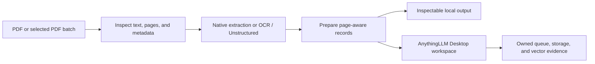
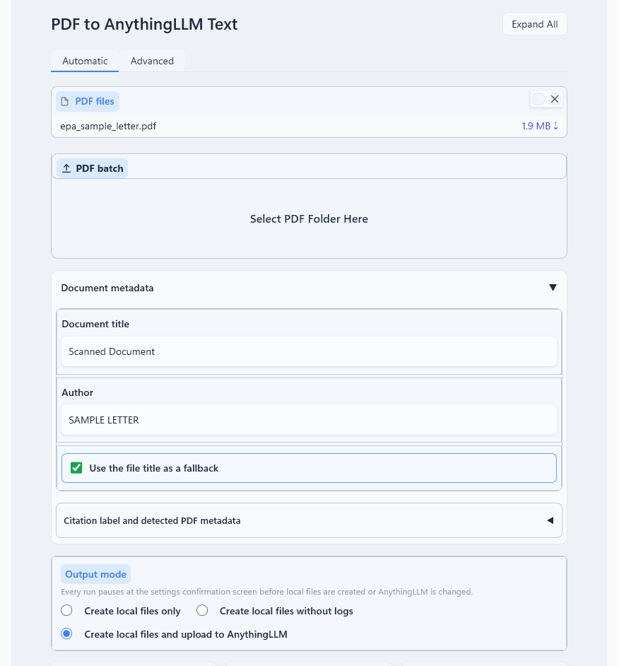
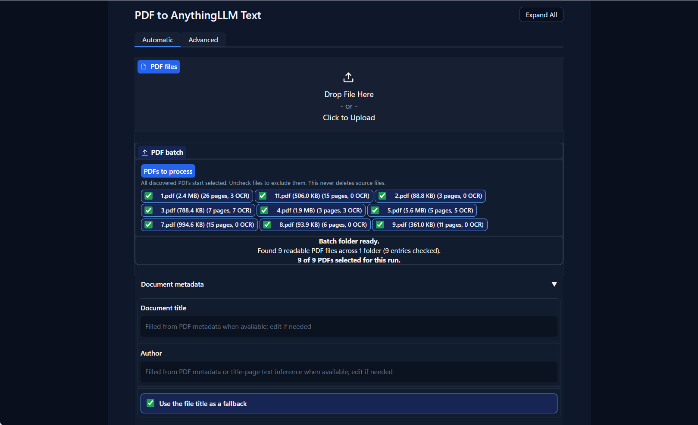

# AnythingLLM PDF Parser and Embedder Assistant

Turn PDFs into inspectable, page-aware text records for
[AnythingLLM Desktop](https://anythingllm.com/desktop)—or keep the prepared
files locally. This AnythingLLM assistant lets users upload massive PDF files and gives them: 
extraction choices, OCR decisions, page settings, local output, and 
AnythingLLM workspace settings and embedding settings. Parse and upload 400 page PDF documents
to AnythingLLM Desktop (Windows 11) in 2 minutes. Parser Assistant can be operated
with graphical user interface (no terminal commands or coding required). Install in one click.

The assistant knows when a file has been uploaded and embedded and waits for exact evidence of
vector embeddings before calling the workspace ready. You will not even have to upload and embed
the finished PDF file, it is automatically done for you. (Changeable in the settings).

> **Beta software, built with generative AI.**
> Although it should work, test the results in your own AnythingLLM setup before relying
> on it for business critical work. This project is independent of Mintplex Labs and AnythingLLM, and is
> provided under the MIT License without warranty.

## Start here

1. Install and open AnythingLLM Desktop. Configure and test its embedding
   provider there.
2. Download [Install-AnythingLLMPdfAssistant.ps1](https://github.com/OPProductivity/anythingllm-pdf-parser-embedder-assistant/releases/download/v0.5.1/Install-AnythingLLMPdfAssistant.ps1).
3. In File Explorer, right-click the downloaded file and choose **Run with
   PowerShell**. Follow the prompts.
4. Open the new **Start AnythingLLM PDF Assistant** desktop shortcut, choose a
   PDF, review the settings, and select **Confirm and start processing**.

You do not need Git, a repository checkout, or a pre-existing Python setup for
the recommended installation. The installer explains any missing dependency
and asks before offering an optional Python installation.

For a complete installation guide, normal workflow, troubleshooting, and the
meaning of each result, read [Detailed instructions](docs/DETAILED-INSTRUCTIONS.md).

## Why use it?

- **Keep control of the source text.** Prepare text locally with native
  extraction, selective/full OCR, or Unstructured-assisted extraction for
  difficult layouts.
- **Preserve useful provenance.** Choose whole-page, page-preserving,
  page-local, or contiguous Custom Range records before AnythingLLM applies
  its own internal splitter.
- **Process a deliberate batch.** Choose individual PDFs or recursively scan a
  folder, inspect the selected files, then confirm before any workspace change.
- **Retain evidence, not just a success toast.** Local outputs and run reports
  distinguish preparation, storage, vector confirmation, and optional live
  retrieval diagnostics.
- **Use AnythingLLM your way.** Create local files only, create compact local
  output, or upload prepared records to an explicitly chosen existing or new
  workspace.

## What it does



### Output modes

| Mode | Result |
| --- | --- |
| **Create local files only** | Creates a compact transcript/segment export directly in one folder named after the selected PDF, or the first and last PDF when processing a batch. Nothing is submitted to AnythingLLM. |
| **Create local files with diagnostic logs** | Creates a local transcript, segments, and ordinary run evidence. The transcript and segment files sit directly in the document output folder. Nothing is submitted to AnythingLLM. |
| **Create local files and upload to AnythingLLM** | Creates local output, with the transcript and segments directly in the document output folder, then submits prepared records to an explicitly selected existing workspace or a newly created workspace after confirmation. |

### Segmentation choices

| Mode | Practical result |
| --- | --- |
| **All in one file** | One prepared record for the PDF. AnythingLLM may still split it internally; page-level identity is not promised. |
| **Whole-page chunks** | One prepared record for each extracted source page. |
| **Page – preserve automatically** | Keeps source-page identity while splitting an over-large page locally only when necessary for the upload boundary. |
| **Shorter page-local passages** | Creates smaller page-addressable passages for more granular retrieval. |
| **Custom Range** | Creates contiguous page-range records. `20` repeats 20-page groups; `20, 30, 20` repeats that sequence for each PDF. |

Custom Range produces a **page-range parent identity**, such as pages 21–50.
It preserves provenance for that range, not a promise that a downstream
AnythingLLM citation will identify one individual page within it.

## Screenshots

The full historical screenshot collection is now versioned in
[docs/screenshots](docs/screenshots/README.md), rather than being embedded as
a long, hard-to-navigate README gallery. Images are visual examples of the
workflow; labels, layouts, and progress values can differ between versions.

| Automatic setup | Processing evidence |
| --- | --- |
|  |  |

## Important limits

- This is Windows software for a locally running AnythingLLM Desktop instance.
- The assistant automatically parses and embeds PDF files only in workspaces that you select (no EPUB)
- Your configured embedding provider—not this README—determines provider cost,
  privacy, availability, and much of the upload duration.
- AnythingLLM owns the global embedding queue and may re-split submitted text.
  The assistant does not create unsafe client-side queue concurrency or retry
  storms.
- OCR and extraction can improve difficult PDFs, but cannot guarantee correct
  reading order, tables, scans, images, or every citation.
- The assistant never overwrites or deletes an existing AnythingLLM workspace.
  Review the selected workspace before confirming an upload.

## Privacy and local data

PDF extraction, OCR decisions, segmentation, local artifacts, and this app's
own run reports remain on the machine. Upload mode submits prepared text to
AnythingLLM Desktop, whose configured embedding provider may be local or
cloud-hosted. Review that provider's policy before processing sensitive text.

By default, generated output, logs, and local configuration are kept under
`%LOCALAPPDATA%\AnythingLLM PDF Parser Embedder Assistant`. Set
`ANYTHINGLLM_PDF_ASSISTANT_HOME` before launch to use another writable location.
Generated paths must stay within the app's Windows-compatible 250-character
safety limit; choose a shorter output root if necessary.

Compact local-only exports contain no run logs. The app retains only its
privacy-minimal ETA calibration records under `private-run-history\timing-model`
inside this app-data folder; that folder is separate from the chosen export
location and contains no extracted PDF text or API keys.

Never commit or publish private PDFs, local paths, AnythingLLM Desktop storage,
raw run reports, API keys, or provider credentials.

## More help

- [Detailed instructions](docs/DETAILED-INSTRUCTIONS.md) — installation,
  pickers, segmentation, progress, results, Advanced diagnostics, and
  troubleshooting.
- [AnythingLLM integration](docs/ANYTHINGLLM-INTEGRATION.md) — exact
  page/page-range evidence, queue ownership, recovery boundaries, and the
  optional refresh bridge.
- [Screenshot gallery](docs/screenshots/README.md) — all screenshots formerly
  embedded in this README.

### Command-line and shortcut support

The desktop installer creates Start and Stop shortcuts. You can also run:

```powershell
anythingllm-pdf-assistant start --browser
anythingllm-pdf-assistant doctor
anythingllm-pdf-assistant paths
anythingllm-pdf-assistant shortcuts repair
```

For manual `pipx` installation and bridge commands, see the detailed guide.

## Development

```powershell
py -m pip install -e .
py -m pytest -q
py -m pre_commit run --all-files
```

Please redact credentials, private PDF text, local paths, workspace data, and
AnythingLLM storage archives from bug reports. Alternatively you can also keep your forked repo private.

## References

- [AnythingLLM source](https://github.com/Mintplex-Labs/anything-llm)
- [AnythingLLM documentation](https://docs.anythingllm.com/)
- Local AnythingLLM developer API documentation: `http://127.0.0.1:3001/api/docs`
- [pipx documentation](https://pipx.pypa.io/)

## License

MIT. See [LICENSE](LICENSE).
