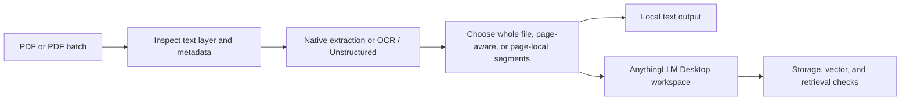

# AnythingLLM PDF Parser Embedder Assistant

**Local PDF-to-text, OCR, page-aware chunking, and AnythingLLM Desktop upload
automation for retrieval-augmented generation (RAG).**

This AnythingLLM (Windows 11) assistant turns one PDF, a selected batch or folder of
PDFs, into clean text files, and uploads them and embeds them to AnythingLLM. AnythingLLM itself does not support
uploading PDF files, and uses .TXT or .JSON. Optionally split files into one or more segments per page and send
the prepared records in a subfolder to your local AnythingLLM Desktop workspace installed on the user's pc. It is designed for people who want
to more easily work with PDFs inside AnythingLLM. You can also create local files only (only parse/perform OCR) to automatically convert PDFs to TXT and then upload to AnythingLLM manually. The advantage is that this software works with existing PDF metadata and bookmarks and can also recognize title pages, content index, bibliography and more (which can be excluded) and can also perform OCR on only a subset (5 out of 20 pages only need OCR).
Doing this automatically or in batch mode is faster than manually creating  workspaces and uploading and embedding pdf files.
Depending on whether you use local ollama embedders, or openrouter embedders via api key, this can be done under half a minute per pdf. 
The app communicates with AnythingLLM settings and workspaces through the official AnythingLLM API key. Be sure to vet the codebase of this app (manually or using AI) to see if it complies with your own data processing protocols, as it will be able to make embedding decisions using local python scripts. The app operates via a localhost structure at port 7860 (http://127.0.0.1:7860/) and is a completely local app. But it uses the AnythingLLM app to send PDFs to local embedders (privacy-friendly) or cloud embedder providers (different data processing policies) using the provided (default) settings and the settings you have made personally in the AnythingLLM app. Start up AnythingLLM before using the app.

AnythingLLM PDF Parser Embedder Assistant supports parsing native-text PDFs, PDFs that need OCR (using Tesseract) for all 
pages or a subset of pages, and can also use the Unstructured library for text extraction 
from tables and documents with complex layout. It can do whole documents, whole-page chunks, automatically page-preserved records, and shorter
page-local passages and can do a custom range of pages or all pages.

> **AI-assisted disclosure:** this project was completely vibe-coded through
> iterative AI-assisted development. Treat it as beta software: review the
> generated outputs and test it with your own AnythingLLM configuration before
> using it for consequential work.

> **Use at your own risk.** This software is provided under the MIT License,
> without warranty of any kind. It is not affiliated with, endorsed by, or
> supported by Mintplex Labs or AnythingLLM.


## Example Screenshots


## Why use it?

- Preserve PDF pages for citing or retrieving directly from page (higher LLM citation accuracy).
- Convert PDFs into text records before embedding.
- Parse PDF files in batches
- Upload your pdf, and use the default settings by simply clicking "Confirm and start processing" at the bottom of the page,
  and let the app create a new workspace for you with the title of the pdf file itself.
- Parse & Upload PDFs in batches at the same time to AnythingLLM (new or existing workspace) without clicking through menus for each PDF
- Choose a segmentation strategy that fits retrieval quality and speed (one file, multiple files)
- Prepare and upload a single PDF, several selected PDFs, or a batch folder.
- Keep parsing and OCR locally when you do not want to upload anything.
- Detect extraction, OCR, embedding, workspace, and retrieval failures
- Parse advanced PDFs using complex python scripts
- Easy localhost user interface - no terminal required
- Dark Theme and Light Theme (also follows System Theme if your windows dark mode only activates at night)
- Adheres to common embedder context size limits
- Use the optional desktop refresh bridge to make AnythingLLM Desktop reflect
  completed document changes more reliably.

AnythingLLM supports multiple document types, including PDFs. This assistant
intentionally prepares text records because controlling the text record and its
page metadata gives page-aware retrieval a clear, inspectable boundary.

## What it does



### Output modes

| Mode | Result |
| --- | --- |
| **Create local files only** | Parsed transcript and selected segments with run evidence. |
| **Create local files without logs** | A compact output folder containing only the parsed transcript and text segments. |
| **Create local files and upload to AnythingLLM** | Local output plus workspace upload, embedding queue submission, and post-upload checks. |

### Segmentation choices

- **All in one file:** one text record for the entire PDF.
- **Whole-page chunks:** one record for each extracted page.
- **Page – preserve automatically:** page-addressable records, with page-local
  splitting only where necessary to fit the effective upload boundary.
- **Shorter page-local passages:** smaller page-addressable passages for more
  granular retrieval.

The app reports what it observed. It does not claim that an AnythingLLM document
drawer view alone proves retrieval readiness; storage, vectors, and runtime
retrieval are separate checks.

## Quick start

### Requirements

- Windows 10/11
- Python 3.11–3.14
- [pipx](https://pipx.pypa.io/)
- [AnythingLLM Desktop](https://anythingllm.com/desktop) running locally when
  you use the upload mode
- An embedding provider configured and working in AnythingLLM Desktop (install Ollama on your PC or configure OpenRouter API key inside AnythingLLM)

### Installation

## Install the app directly from this Github Repository to your Windows PC:
```powershell
py -m pip install --user pipx
py -m pipx ensurepath
pipx install git+https://github.com/OPProductivity/anythingllm-pdf-parser-embedder-assistant.git
```

Close and reopen PowerShell if `pipx ensurepath` changed your PATH. Then start
the local app:

```powershell
anythingllm-pdf-assistant start --browser
```

The app opens at `http://127.0.0.1:7860`. Use these diagnostics if needed:

```powershell
anythingllm-pdf-assistant doctor
anythingllm-pdf-assistant paths
```

For a development checkout, clone the repository and run `pipx install .` in
the repository root instead.

## How to use the app

1. Start AnythingLLM Desktop and confirm that its embedding provider works.
2. Start this assistant with `anythingllm-pdf-assistant start --browser` (or use the desktop shortcut).
3. Upload a PDF, choose several PDFs, or select a batch folder.
4. Review the detected PDF metadata and set title/author information if needed.
5. Select an output mode and a segmentation mode.
6. For upload mode, choose an existing workspace or create a new one.
7. Confirm the settings. The app creates local outputs before changing the
   AnythingLLM workspace.
8. Review the completion state and the generated output folder. For upload
   runs, distinguish local preparation, document storage, vector observation,
   and retrieval evidence in the run report.

For a detailed walkthrough, see [docs/USAGE.md](docs/USAGE.md).

## Screenshots


## AnythingLLM integration

The upload workflow uses AnythingLLM's local HTTP APIs and its documented
workspace/document model where available. It deliberately keeps provider keys
inside AnythingLLM Desktop: no provider API key is read from, stored in, or
committed by this repository.

The optional refresh bridge is a separate, opt-in desktop integration. It
patches the installed desktop archive only after validating known anchors and
creating a timestamped backup. Close AnythingLLM Desktop before changing the
bridge.

```powershell
anythingllm-pdf-assistant bridge validate
anythingllm-pdf-assistant bridge install
anythingllm-pdf-assistant bridge uninstall
```

See [docs/ANYTHINGLLM-INTEGRATION.md](docs/ANYTHINGLLM-INTEGRATION.md) before
using the bridge or relying on a workspace for citations.

## Local data, privacy, and safety

- Generated output, logs, and local configuration live under
  `%LOCALAPPDATA%\AnythingLLM PDF Parser Embedder Assistant` by default.
- Set `ANYTHINGLLM_PDF_ASSISTANT_HOME` before launching to use another writable
  location, including a portable drive.
- Your PDFs remain local unless you choose AnythingLLM upload. Your configured
  AnythingLLM embedding provider may send text to the provider you selected;
  check that provider's policy before uploading sensitive material.
- Never commit `.env` files, AnythingLLM Desktop storage, run output, logs,
  private PDFs, API keys, or desktop backups.
- This project is not a security boundary, legal advice, a backup system, or a
  guarantee that any answer produced by an LLM is correct.

## Development

```powershell
py -m pip install -e .
py -m pytest -q
py -m pre_commit run --all-files
```

Contributions, bug reports, and reproducible test cases are welcome. Read
[CONTRIBUTING.md](CONTRIBUTING.md) and [SECURITY.md](SECURITY.md) first.

## Related projects and official references

- [AnythingLLM](https://github.com/Mintplex-Labs/anything-llm)
- [AnythingLLM documentation](https://docs.anythingllm.com/)
- AnythingLLM's local developer API documentation at `http://127.0.0.1:3001/api/docs`
- [pipx documentation](https://pipx.pypa.io/)

## License

MIT. See [LICENSE](LICENSE).

## Succesfully Parsing and embedding a PDF with 2 columns of text per page - 6 page pdf - 0 OCR pages - parsed - split into 6 - embedded into AnythingLLM

Start:


Completed succesfully.


## Succesfully Parsing and embedding a normal PDF - 678 pages pdf - 0 OCR pages - parsed - split into 6 - embedded into AnythingLLM

Start:


